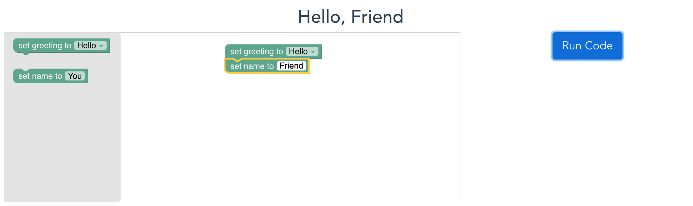

<div align="center">
<h1>AP Block</h1>
<p>A collection of online, interactive labs that utilize a block-based program to enhance learning across many subjects.<br>
Try it out here! <a href="https://www.apblock.education">apblock.education</a>
</p>
</div>



## Contributing

This code could be improved a ton in a bunch of ways, but some of my top priorities right now are:
- Adding more cool labs!
- Finding a better way to access the `<canvas></canvas>` in the DOM without using Vue prototypes.
- Fix the file structure and compartmentalize assets.
- Figure out subdomain redirects so that links to specific labs don't just redirect to the main page.

Are you a programmer? Contribute code by:
1. Cloning the project
2. Making a new branch with a name that makes sense
3. Make bugfixes or even add a new lab!
4. Make a pull request and email me @ tristrumtuttle at gmail (I sometimes miss GitHub notifications)

Anyone can help!
- Fill out this google form to suggest new labs: https://forms.gle/tC97pvWrfGy9L4zbA

## Project Setup

This project uses Vue JS and npm. Some important files:
- `main.js`: AP Block is a SPA and the routes, plugins, etc are all set here. To add a new lab, make a component and import it / add the route to the list of routes here.
- `App.vue`: This component renders the sub-components and holds the navbar, after adding a lab you can also add a link to it in the navbar.
- `BlocklyComponent.vue`: This reusable component is imported into each lab and renders the blockly workspace. Any changes here will affect all labs, so beware!
- `instructions/LabTab.vue`: This reusable component makes it easy to add lab instructions, look at the other labs for example usage. All images must be added to the `assets/images` folder.

More tips:
- Each lab has a vue component file that holds the UI and a js file that holds the block definitions for the blockly workspace.
- Blockly workspace code for each lab should be run using the JS Interpreter - look at other labs for examples and read the documentation here: https://neil.fraser.name/software/JS-Interpreter/docs.html
- Use Vuex to get data into and out of the JS Interpreter so that it can render dynamically in the vue component.
- I've been setting up the `waitForSeconds` block differently from the other imported blocks, since it is used in every lab. Specifically, I define it directly in the vue component instead of in each lab's js file. 

Useful links:
- Use this Blockly site to make blocks super easily: https://blockly-demo.appspot.com/static/demos/blockfactory/index.html
- The JS Interpreter is a tricky thing: https://neil.fraser.name/software/JS-Interpreter/docs.html
- The Blockly Vue example is also useful: https://github.com/google/blockly-samples/tree/master/examples/blockly-vue
- I use Vuex pretty extensively: https://vuex.vuejs.org/

### Get Started
Use npm to install dependencies:
```
npm install
```
Then run the app with hot-reloads for development:
```
npm run serve
```

<!-- ### Compiles and minifies for production
```
npm run build
```
 -->
### Lints and fixes files
```
npm run lint
```

### Customize configuration
See [Configuration Reference](https://cli.vuejs.org/config/).
